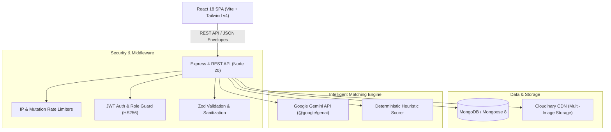

# Campus Lost & Found — Intelligent University Retrieval Portal

[](https://github.com/campus-lost-found/campus-lost-found/actions)


A modern full-stack MERN application connecting campus community members to report lost and found belongings, discover AI-suggested item matches, submit verified ownership claims, and coordinate safe handovers while maintaining strict student contact privacy.

---

## Architecture Overview



---

## Key Features

- **Item Reporting & Visual Documentation**:
  - Multi-image uploads (JPEG/PNG/WebP, up to 5MB each, max 5 images) with direct Cloudinary CDN integration and memory buffer validation.
  - Interactive "Help me describe it" assistant powered by Google Gemini, extracting keywords, categories, and clarifying questions from unstructured text.
- **Dual-Engine Intelligent Matching**:
  - Deterministic fallback heuristic scoring (category match, campus location token overlap, date proximity, title/description Jaccard similarity).
  - High-precision Gemini LLM batch candidate evaluation returning structured 0–100 confidence scores.
  - Automated in-app notifications dispatched to both parties upon finding match candidates.
- **Ownership Claim State Machine**:
  - Claimants submit proof details and messages without exposing identifying listing secrets publicly.
  - **Zero-Knowledge Contact Privacy**: Reporter email and phone numbers remain strictly concealed on all public endpoints until the item owner officially reviews and approves the claim.
- **Campus Moderation & Real-Time Analytics**:
  - Role-guarded administrative dashboard (`/admin`) displaying recovery rates, 8-week trend comparisons, category distribution donuts, and top misplaced locations.
  - Abuse reporting pipeline auto-flagging suspicious posts for administrator resolution.
  - User moderation with account suspension and cascading cleanup preventing self-lockout or deleting the last admin.

---

## Tech Stack

| Layer | Technologies |
|---|---|
| **Frontend** | React 18, Vite, Tailwind CSS v4, React Router 6, React Hook Form, Zod, Lucide React, Recharts, React Hot Toast, date-fns |
| **Backend** | Node.js 20, Express 4, Mongoose 8, Zod, jsonwebtoken, bcryptjs (cost 12), Multer, Helmet, CORS, Express Rate Limit, Morgan |
| **External Services** | Google Gemini AI (`@google/genai`), Cloudinary SDK (Image Asset Hosting) |
| **Testing** | Jest, Supertest, MongoDB Memory Server (Backend); Vitest, React Testing Library, jsdom (Frontend) |
| **DevOps** | Docker, Docker Compose, Nginx (Alpine), GitHub Actions CI |

---

## Quickstart

### Prerequisites
- Node.js 20+
- npm 10+
- (Optional) Docker & Docker Compose
- (Optional) MongoDB running locally or MongoDB Atlas URI

### Option A: Local Development

1. **Clone the repository**:
   ```bash
   git clone https://github.com/campus-lost-found/campus-lost-found.git
   cd campus-lost-found
   ```

2. **Install all monorepo dependencies**:
   ```bash
   npm run setup
   ```

3. **Configure Environment Variables**:
   Copy `.env.example` in both `server/` and `client/`:
   ```bash
   cp server/.env.example server/.env
   cp client/.env.example client/.env
   ```

4. **Seed Sample Campus Data**:
   Populates campus buildings, sample students, mock administrators, listings, claims, and AI matches:
   ```bash
   npm run seed
   ```

5. **Start Dev Servers**:
   Runs both backend (`localhost:5000`) and frontend (`localhost:5173`) concurrently:
   ```bash
   npm run dev
   ```

### Option B: Docker Compose

Spin up the full containerized stack (MongoDB 7, Express API, Nginx React SPA):
```bash
docker compose up --build
```
- Frontend UI: [http://localhost](http://localhost)
- Backend API: [http://localhost:5000/api/health](http://localhost:5000/api/health)

---

## Environment Variables Reference

### Server (`server/.env`)
| Variable | Description | Default |
|---|---|---|
| `PORT` | API Server Port | `5000` |
| `NODE_ENV` | Environment mode (`development`, `production`, `test`) | `development` |
| `CLIENT_URL` | Allowed CORS origin | `http://localhost:5173` |
| `MONGO_URI` | MongoDB connection URI | `mongodb://localhost:27017/campus-lost-found` |
| `JWT_SECRET` | Secret key for signing HS256 tokens (min 32 chars) | — |
| `RATE_LIMIT_ENABLED` | Toggle rate limiting on/off (`true`/`false`) | `false` |
| `RATE_LIMIT_MAX` | Max allowed requests per 15-min window when rate limiting is enabled | `100` |
| `GEMINI_API_KEY` | Google Gemini API key (blank enables heuristic fallback) | — |
| `GEMINI_MODEL` | Gemini model identifier | `gemini-2.5-flash` |
| `CLOUDINARY_CLOUD_NAME` | Cloudinary account cloud name | — |
| `CLOUDINARY_API_KEY` | Cloudinary API Key | — |
| `CLOUDINARY_API_SECRET` | Cloudinary API Secret | — |

#### Rate Limiting Configuration
Rate limiting is **disabled by default (`RATE_LIMIT_ENABLED=false`)** to prevent request throttling during local development, browsing, and frontend testing.

To enable rate limiting in production or staging environments:
1. Set `RATE_LIMIT_ENABLED=true` in `server/.env`.
2. Configure `RATE_LIMIT_MAX` (default `100`) to define the maximum requests permitted per IP per 15-minute window. Endpoint-specific limiters (mutations, auth, AI assistance, rematch) scale proportionally with this configured threshold.

### Client (`client/.env`)
| Variable | Description | Default |
|---|---|---|
| `VITE_API_URL` | Base endpoint for Express API | `http://localhost:5000/api` |
| `VITE_USE_MOCK` | Toggle frontend mock data fallback (`true`/`false`) | `false` |

---

## Root NPM Scripts

| Script | Purpose |
|---|---|
| `npm run dev` | Runs client and server concurrently with live-reloading |
| `npm test` | Runs the full test suite (85 backend Jest tests + 28 frontend Vitest tests) |
| `npm run lint` | Runs ESLint across both server and client |
| `npm run build` | Compiles client production build to `client/dist` |
| `npm run seed` | Seeds MongoDB with test items, users, and matches |

---

## Automated Test Harness

The test suite contains **113 automated tests** across 17 test suites verifying security invariants, rate limits, AI heuristics, file uploads, and UI workflows:

```bash
# Run all tests across the monorepo
npm test

# Run frontend tests with Vitest
npm --prefix client test

# Run backend tests with Jest
npm --prefix server test
```

---

## Deployment Guide

### 1. MongoDB Atlas Database
1. Create a free cluster on [MongoDB Atlas](https://www.mongodb.com/cloud/atlas).
2. Create a database user and allow network access (`0.0.0.0/0` or cloud provider IPs).
3. Copy the SRV URI: `mongodb+srv://<user>:<password>@cluster.mongodb.net/campus-lost-found?retryWrites=true&w=majority`.

### 2. Backend Deployment (Render / Railway)
1. Link your GitHub repository.
2. Root directory: `server`.
3. Build command: `npm ci --omit=dev`.
4. Start command: `node src/server.js`.
5. Set environment variables: `MONGO_URI`, `JWT_SECRET`, `CLIENT_URL` (your frontend domain), `NODE_ENV=production`, `CLOUDINARY_*`, `GEMINI_API_KEY`.

### 3. Frontend Deployment (Vercel / Netlify)
1. Link your GitHub repository.
2. Root directory: `client`.
3. Build command: `npm run build`.
4. Output directory: `dist`.
5. Set environment variable: `VITE_API_URL=https://your-api.onrender.com/api`.
6. SPA routing configuration: Add `_redirects` (`/* /index.html 200`) or `vercel.json` rewrites.

---

## Step-by-Step Live Demo Script

1. **Sign In**: Navigate to `/login`. Click **Student (John)** to prefill demo credentials (`john.doe@campus.test` / `Password123!`).
2. **Report Lost Item with AI Assist**:
   - Go to **Report Lost Item** (`/report/lost`).
   - In Description, type *"Left my silver noise cancelling headphones in the main library study carrel"*.
   - Click **Help me describe it (AI)**. Notice how title, category (`ELECTRONICS`), and locations are automatically suggested.
   - Click **Publish Lost Report**.
3. **Smart Matching**:
   - Navigate to `/matches` or the newly created item's details page.
   - Observe suggested item matches found in the directory with confidence percentage scores and matching criteria badges.
4. **Ownership Claim & Privacy Handover**:
   - Log out, sign in as **Priya** (`priya.patel@campus.test`).
   - Find John's listing and click **Claim Ownership**.
   - Input claim message and secret distinguishing feature.
   - Log back in as John; review and click **Approve Claim**. Notice how contact info is revealed for verified collection.
5. **Admin Moderation & Analytics**:
   - Sign in as **Administrator** (`sarah.admin@campus.test` / `Password123!`).
   - Navigate to `/admin` to view live resolution rates, category charts, user moderation, and abuse reports.

---

## Resume & Portfolio Highlight

> **Campus Lost & Found Platform**  
> *MERN Stack, Google Gemini AI, Cloudinary, Docker, Vitest, Jest*  
> - Designed and deployed a full-stack campus asset recovery platform supporting multi-image uploads, location-based filtering, and automated notification dispatches.  
> - Engineered a dual-engine matching pipeline pairing deterministic heuristics with Google Gemini LLM scoring, achieving sub-second matching with graceful offline fallbacks.  
> - Implemented verified claim workflows with strict zero-knowledge contact privacy, preventing PII exposure prior to owner approval.  
> - Maintained 113 automated unit and integration tests (Jest, Supertest, Vitest, React Testing Library) achieving zero Critical/High vulnerabilities in pre-flight security audits.

---

## License
MIT License. Built for university communities everywhere.
